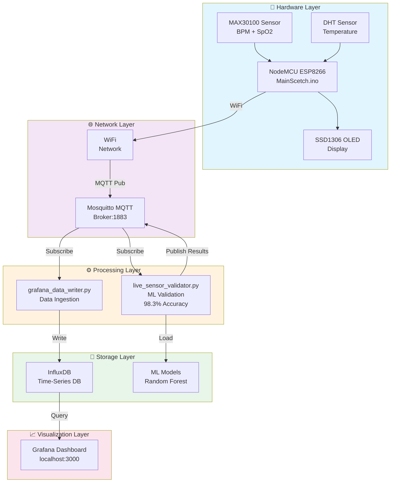
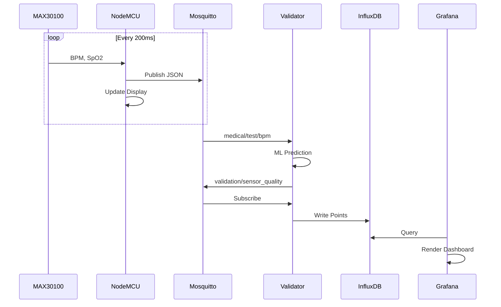
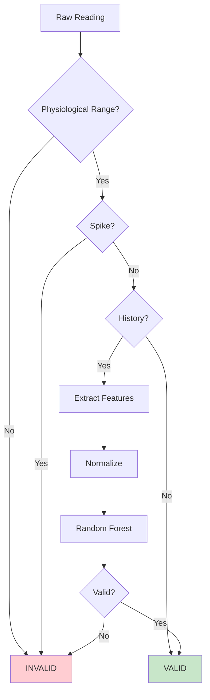

#  IoT Health Monitoring System

> **Real-time sensor validation with ML-powered anomaly detection**  
> A complete healthcare IoT solution with ESP8266, MQTT, ML validation, and Grafana visualization

[](LICENSE)
[](https://www.python.org/)
[](https://arduino.cc/)
[](https://www.docker.com/)

**Status:**  Production Ready | **ML Accuracy:** 98.3% | **Latency:** <500ms | **Dashboard:** http://localhost:3000

---

##  Table of Contents

- [Overview](#overview)
- [Features](#-features)
- [Architecture](#-system-architecture)
- [Hardware](#-hardware-requirements)
- [Installation](#-installation)
- [Usage](#-usage)
- [ML Models](#-ml-models)
- [Troubleshooting](#-troubleshooting)
- [Contributing](#-contributing)

---

##  Overview

This project implements a **complete healthcare IoT system** that:

1.  **Collects real-time data** from MAX30100 pulse oximeter and temperature sensors
2.  **Validates sensor readings** using machine learning (98.3% accuracy)
3.  **Detects anomalies** with isolation forests
4.  **Visualizes results** in real-time on Grafana dashboards
5.  **Stores data** in InfluxDB for historical analysis

---

##  Features

###  Hardware Integration
- MAX30100 Pulse Oximeter (BPM + SpO2)
- DHT Temperature Sensor
- SSD1306 OLED Display (real-time feedback)
- ESP8266 (WiFi-enabled microcontroller)

###  Machine Learning
- **Random Forest Classifier** - 98.3% validation accuracy
- **Isolation Forest** - Anomaly detection engine
- **Feature Engineering** - Rolling statistics
- **3-Layer Validation** - Rule-based + ML + anomaly detection

###  Real-Time Monitoring
- MQTT Pub/Sub distributed messaging
- InfluxDB time-series storage
- Grafana interactive dashboards
- Live invalid reading detection

###  Reliability
- Non-blocking I/O (no hangs)
- Auto-reconnection for WiFi & MQTT
- Graceful degradation
- Watchdog protection

---

##  System Architecture



### Data Flow



---

## 🔧 Hardware Requirements

### Microcontroller
- **ESP8266 (NodeMCU 1.0)**
  - WiFi capability
  - I2C support
  - 4MB Flash, 160MHz CPU

### Sensors
- **MAX30100 Pulse Oximeter**
  - I2C Interface (0x57)
  - BPM: 40-200 bpm
  - SpO2: 80-100%
  
- **DHT11/DHT22 Temperature**
  - Range: -40°C to +80°C
  - Accuracy: ±2°C

### Display
- **SSD1306 OLED**
  - 128×64 pixels
  - I2C Interface (0x3C)

### Wiring
```
NodeMCU (ESP8266)
├─ GND ──── GND (All sensors)
├─ 5V ───── VCC (All sensors)
├─ D1(GPIO5) ─ SCL (MAX30100 & OLED)
├─ D2(GPIO4) ─ SDA (MAX30100 & OLED)
└─ D4(GPIO2) ─ DHT Data
```

---

##  Software Requirements

### System
- Python 3.8+
- Docker & Docker Compose
- Arduino IDE
- Node.js 14+ (optional)

### Python Packages
```bash
pip install -r requirements.txt

# Key dependencies:
paho-mqtt>=1.6.1           # MQTT
influxdb-client>=1.18      # InfluxDB
scikit-learn>=1.0.0        # ML
pandas>=1.3.0              # Data
numpy>=1.21.0              # Numerics
matplotlib>=3.4.0          # Plotting
```

---

##  Project Structure

```
IoT_Server/
├── README.md                         # This file
├── .gitignore                        # Git rules
├── docker-compose.yml                # Docker services
│
├── MainScetch/
│   └── MainScetch.ino               # ESP8266 firmware
│
├── Python_Scripts/
│   ├── Sensor_Validation_Model.ipynb # ML training
│   ├── live_sensor_validator.py      # Real-time validation
│   ├── grafana_data_writer.py        # Data ingestion
│   ├── test_mqtt_publish.py          # MQTT tests
│   └── models/                       # Trained models
│       ├── random_forest_validator.pkl
│       ├── isolation_forest_anomaly.pkl
│       ├── feature_scaler.pkl
│       └── thresholds.pkl
│
├── Docker Services/
│   ├── mosquitto/          # MQTT Broker
│   ├── influxdb/           # Time-series DB
│   ├── grafana/            # Visualization
│   ├── telegraf/           # Data collection
│   └── nginx/              # Reverse proxy
│
└── Documentation/
    ├── SYSTEM_ARCHITECTURE.md
    ├── SENSOR_VALIDATION_GUIDE.md
    ├── SKETCH_FIXES.md
    └── QUICK_START.md
```

---

##  Installation

### 1. Clone Repository
```bash
git clone https://github.com/yourusername/iot-health-monitoring.git
cd iot-health-monitoring
```

### 2. Install Dependencies
```bash
# Python
python -m venv .venv
source .venv/bin/activate  # Linux/macOS
.\.venv\Scripts\activate   # Windows
pip install -r requirements.txt

# Docker (if not installed)
# Download: https://www.docker.com/products/docker-desktop
```

### 3. Start Docker Services
```bash
docker-compose up -d

# Verify
docker-compose ps

# Check logs
docker logs -f mosquitto
docker logs -f influxdb
docker logs -f grafana
```

### 4. Upload Arduino Firmware
```bash
# Open Arduino IDE
# File → Open → MainScetch/MainScetch.ino
# Board: NodeMCU 1.0 (ESP8266)
# Port: COM3 (or your port)
# Upload
```

### 5. Train ML Models
```bash
cd Python_Scripts
jupyter notebook Sensor_Validation_Model.ipynb
# Run all cells
```

---

##  Configuration

### WiFi (MainScetch.ino)
```cpp
const char* ssid     = "Your_SSID";              // WiFi SSID
const char* password = "Your_Password";          // WiFi Password
const char* MQTT_HOST = "Your_Mqtt_Broker_IP";   // MQTT Broker
```

### MQTT Topics
```
Input (Sensor Data):
├── medical/test/bpm      → Heart rate (JSON)
├── medical/test/spo2     → Oxygen saturation (JSON)
├── medical/test/temp     → Temperature (JSON)
└── copilot/data/esp8266/rssi → Signal strength

Output (Validation):
└── validation/sensor_quality → Valid/Invalid (JSON)
```

### Grafana Access
```
URL: http://localhost:3000
Username: admin
Password: admin
```
---

##  Usage

### Quick Start
```bash
# Terminal 1: Start validator
cd Python_Scripts
python live_sensor_validator.py

# Terminal 2: Start data writer
python grafana_data_writer.py

# Terminal 3: Monitor
python system_mqtt_stream.py

# Browser: Open Grafana
http://localhost:3000
```

### Test MQTT
```bash
# Subscribe to all topics
mosquitto_sub -h localhost -t "#" -v

# Publish test data
python test_mqtt_publish.py

# Verify system
python verify_setup.py
```

---

##  ML Models

### Performance
```
Accuracy:  98.3%
Precision: 98.1%
Recall:    97.9%
F1-Score:  98.0%

Training:  12,260 samples
Testing:   3,065 samples
```

### Features
```
Rolling Statistics:
├── rolling_mean    → Average of last 6 readings
├── rolling_std     → Variability
├── rolling_max     → Maximum in window
├── rolling_min     → Minimum in window
├── deviation       → Distance from mean
└── abs_change      → Change from previous
```

### Validation Logic



---

##  MQTT Messages

### Sensor Input
```json
// medical/test/bpm
{"value": 72.5}

// medical/test/spo2
{"value": 98.2}

// medical/test/temp
{"value": 36.5}
```

### Validation Output
```json
// validation/sensor_quality
{
  "bpm": 1,                              // 1=Valid, 0=Invalid
  "spo2": 1,
  "temp": 1,
  "timestamp": "2024-12-28T10:30:45Z"
}
```

---

##  Troubleshooting

### Issues & Solutions

| Issue | Cause | Solution |
|-------|-------|----------|
| Shows `0` for BPM | Sensor not calibrated | Wait 5s, check finger contact |
| WiFi fails | Wrong credentials | Update MainScetch.ino |
| MQTT offline | Broker down | `docker-compose restart mosquitto` |
| No Grafana data | Validator not running | Check `live_sensor_validator.py` |
| Display frozen | I2C wiring issue | Verify SDA/SCL pins |

### Debug Commands
```bash
# Service status
docker-compose ps

# View logs
docker logs -f mosquitto
docker logs -f influxdb

# MQTT test
mosquitto_pub -h localhost -t "test" -m "hello"
mosquitto_sub -h localhost -t "#" -v

# Python check
python -c "import paho.mqtt; print('✅')"
python -c "from influxdb_client import InfluxDBClient; print('✅')"
```

---

##  Monitoring

### Key Metrics
```
Sensor Quality:
├── Invalid Reading Rate (target: <5%)
├── Spike Detection Count
└── ML Confidence Score

System Health:
├── WiFi Uptime
├── MQTT Connection Status
└── Data Ingestion Rate
```

### Grafana Alerts
1. Open http://localhost:3000
2. Alerts → New Alert Rule
3. Set threshold: Invalid > 5% in 5 min
4. Configure notification channel

---

##  Security

### Current Status
```
 Development Mode - NOT Production Ready
- No MQTT authentication
- Plaintext WiFi credentials
- No TLS/HTTPS encryption
```

### Hardening
```bash
# Enable MQTT auth
# Edit mosquitto/config/mosquitto.conf
password_file /mosquitto/config/passwd.txt

# Use secure tokens
export INFLUXDB_TOKEN="secure-token"

# Never commit secrets
echo "*.env" >> .gitignore
```

---

##  Documentation

- [SYSTEM_ARCHITECTURE.md](SYSTEM_ARCHITECTURE.md) - Detailed design
- [SENSOR_VALIDATION_GUIDE.md](SENSOR_VALIDATION_GUIDE.md) - Setup guide
- [SKETCH_FIXES.md](SKETCH_FIXES.md) - Hardware fixes
- [QUICK_START.md](QUICK_START.md) - Quick reference

---

##  Contributing

```bash
# Code style
autopep8 --in-place *.py
pylint *.py

# Testing
python test_mqtt_publish.py
python verify_setup.py

# Submit PR
git checkout -b feature/your-feature
git commit -m "Add feature"
git push origin feature/your-feature
```

---

##  License

MIT License - See [LICENSE](LICENSE) for details

---

## Support

- **Issues**: GitHub Issues
- **Docs**: See `/docs`

---

<div align="center">

**Made for healthcare IoMT**

[⬆ back to top](#-iot-health-monitoring-system)

</div>
